# ultrapack plugin — schema & wiring map

Visual map of every `.md` file under `plugins/up/` and how they reference each other. Use this when chasing where a `_brevity.md` rule, an invariant ID, or a hand-off between skills actually lives.

The diagram covers all **25** loadable artifacts: 5 commands, 12 skills, 2 shared shards, 6 agents.

## Diagram

```mermaid
%%{init: {'flowchart': {'curve': 'basis', 'nodeSpacing': 40, 'rankSpacing': 55}}}%%
flowchart TB

  %% ================ STYLES ================
  classDef command fill:#fff7ed,stroke:#c2410c,stroke-width:2.5px,color:#000
  classDef skill fill:#dbeafe,stroke:#1d4ed8,stroke-width:1.5px,color:#000
  classDef agent fill:#ede9fe,stroke:#6d28d9,stroke-width:2px,color:#000,stroke-dasharray:6 4
  classDef shard fill:#fce7f3,stroke:#9d174d,stroke-width:1px,color:#000

  %% ================ COMMANDS ================
  subgraph CMD ["Commands - user entry points (plugins/up/commands/)"]
    direction LR
    cmdMake["/up:make<br/><sub>commands/make.md</sub>"]
    cmdReflect["/up:reflect<br/><sub>commands/reflect.md</sub>"]
    cmdStepBack["/up:step-back<br/><sub>commands/step-back.md</sub>"]
    cmdSummary["/up:summary<br/><sub>commands/summary.md</sub>"]
    cmdTry["/up:try<br/><sub>commands/try.md</sub>"]
  end

  %% ================ MAIN WORKFLOW SKILLS ================
  subgraph FLOW ["/up:make workflow chain - skills hand-off via Terminal state"]
    direction TB
    sDesign["udesign<br/><sub>skills/udesign/SKILL.md</sub>"]
    sWT["git-worktrees<br/><sub>skills/git-worktrees/SKILL.md</sub>"]
    sPlan["uplan<br/><sub>skills/uplan/SKILL.md</sub>"]
    sExec["uexecute<br/><sub>skills/uexecute/SKILL.md</sub>"]
    sVerify["uverify<br/><sub>skills/uverify/SKILL.md</sub>"]
    sReview["ureview<br/><sub>skills/ureview/SKILL.md</sub>"]
    sDoc["udocument<br/><sub>skills/udocument/SKILL.md</sub>"]

    sDesign == approve ==> sPlan
    sPlan == auto-approve ==> sExec
    sExec == phases committed ==> sVerify
    sVerify == pass ==> sReview
    sVerify -. fail re-execute .-> sExec
    sExec -. deviation re-plans .-> sPlan
  end

  %% ================ HELPER SKILLS ================
  subgraph HELP ["Helper skills - referenced situationally"]
    direction LR
    sHandsoff["handsoff<br/><sub>skills/handsoff/SKILL.md</sub>"]
    sDebug["udebug<br/><sub>skills/udebug/SKILL.md</sub>"]
    sTDD["test-driven-development<br/><sub>skills/test-driven-development/SKILL.md</sub>"]
  end

  %% ================ STANDALONE SKILLS ================
  subgraph STAND ["Standalone - invoked directly, never from /up:make (no edges by design)"]
    direction LR
    sBrainstorm["ubrainstorm<br/><sub>skills/ubrainstorm/SKILL.md</sub>"]
    sPlanFree["uplan-freeform<br/><sub>skills/uplan-freeform/SKILL.md</sub>"]
  end

  %% ================ SHARDS ================
  subgraph SHRD ["Shared shards - non-invocable, included by other skills"]
    direction LR
    shBrev["_brevity.md<br/><sub>skills/_brevity.md</sub>"]
    shPrin["_principles.md<br/><sub>skills/_principles.md - GPC1 to GPC8</sub>"]
  end

  %% ================ AGENTS ================
  subgraph AGT ["Agents - dispatched subagents, fresh context (plugins/up/agents/)"]
    direction LR
    agImpl["implementer<br/><sub>Opus - agents/implementer.md</sub>"]
    agImplS["implementer-sonnet<br/><sub>Sonnet - agents/implementer-sonnet.md</sub>"]
    agExpl["explorer<br/><sub>Haiku - agents/explorer.md</sub>"]
    agRsrch["researcher<br/><sub>Sonnet - agents/researcher.md</sub>"]
    agRev["reviewer<br/><sub>Sonnet - agents/reviewer.md</sub>"]
    agSum["summarizer<br/><sub>Sonnet - agents/summarizer.md</sub>"]
  end

  %% ============ /up:make ORCHESTRATION (solid arrow = direct invocation) ============
  cmdMake -- step 5 enter chain --> sDesign
  cmdMake -- step 6 branch and worktree --> sWT
  cmdMake -- after done docs refresh --> sDoc

  %% ============ STAND-ALONE COMMANDS (dotted arrow = dispatch / reference) ============
  cmdSummary -. dispatches .-> agSum
  sVerify -. verification style .-> cmdTry
  %% /up:reflect and /up:step-back are intentionally stand-alone

  %% ============ AGENT DISPATCHES ============
  sExec -. dispatch default .-> agImpl
  sExec -. dispatch trivial .-> agImplS
  sExec -. dispatch code map .-> agExpl
  sExec -. dispatch research .-> agRsrch
  agImplS -. escalate on NEEDS_CONTEXT .-> agImpl
  sReview -. dispatch .-> agRev

  %% ============ TDD ============
  sDesign -. applicability rule .-> sTDD
  sExec -. if TDD yes .-> sTDD
  agImpl -. if TDD yes .-> sTDD
  agImplS -. if TDD yes .-> sTDD
  sTDD -. records decision in .-> sDesign

  %% ============ DEBUG ============
  sDebug -. loops back to .-> sVerify

  %% ============ HANDS-OFF CONTRACT ============
  cmdMake -. if Mode is hands-off .-> sHandsoff
  sDesign -. hands-off delta .-> sHandsoff
  sPlan -. hands-off delta .-> sHandsoff
  sExec -. hands-off delta .-> sHandsoff
  sVerify -. hands-off delta .-> sHandsoff
  sReview -. hands-off delta .-> sHandsoff
  sHandsoff -. safety worktree-first .-> sWT
  sHandsoff -. unused-cruft caught by .-> agRev

  %% ============ BREVITY SHARD ============
  sDesign -. include principle 1 .-> shBrev
  sPlan -. include .-> shBrev
  sExec -. include .-> shBrev
  sVerify -. include .-> shBrev
  sReview -. include .-> shBrev
  agRev -. bleed-scan .-> shBrev

  %% ============ PRINCIPLES SHARD ============
  sDesign -. GPC1 to GPC8 .-> shPrin
  sPlan -. GPC1 to GPC8 .-> shPrin
  sDebug -. anti-whack-a-mole .-> shPrin

  %% ================ APPLY STYLES ================
  class cmdMake,cmdReflect,cmdStepBack,cmdSummary,cmdTry command
  class sDesign,sWT,sPlan,sExec,sVerify,sReview,sDoc,sHandsoff,sDebug,sTDD,sBrainstorm,sPlanFree skill
  class shBrev,shPrin shard
  class agImpl,agImplS,agExpl,agRsrch,agRev,agSum agent
```

## Reading the diagram

### Node kinds

- **Orange (commands)** — slash-commands the user types (`/up:make`, `/up:try`, …). Thin orchestration layer; holds the user-visible contract.
- **Blue (skills)** — process skills under `plugins/up/skills/<name>/SKILL.md`. Each owns one stage of the workflow (or a helper concern).
- **Pink (shards)** — shared `.md` files under `plugins/up/skills/` whose names start with `_`. Claude Code's loader skips them as invocable skills; they exist only to be `@`-included by other skills. The **single source of truth** for cross-cutting style rules.
- **Purple, dashed border (agents)** — `plugins/up/agents/*.md`. Dispatched as subagents with their own context window and (often) cheaper model. Frontmatter pins `model:` and `tools:`.

### Edge kinds

- `==>` **thick solid** — primary `/up:make` workflow chain (forward progress, normal happy path).
- `-->` **thin solid** — direct invocation: `/up:make` enters the chain, kicks off worktree, runs the docs-refresh.
- `-.->` **dashed** — *anything else*: agent dispatch, hands-off contract reference, shard include, fail-loop back-edges, helper-skill consults.

### Why `/up:make` only points at three skills

`/up:make` is documented as an 11-step orchestrator, but at runtime each skill's **Terminal state** section names the next skill to invoke. The chain self-propagates from `udesign` onward — `/up:make` only needs to (a) start the chain at `udesign`, (b) branch/worktree decision via `git-worktrees`, and (c) docs-refresh via `udocument` after `Status=done`. The intermediate hops are emergent, not orchestrated.

## File inventory (all 25)

### Commands — `plugins/up/commands/`

- `make.md` — full ultrapack workflow orchestrator
- `reflect.md` — extract dialogue learnings, route to CLAUDE.md / memory / docs
- `step-back.md` — circuit breaker after repeated failures
- `summary.md` — dispatches `summarizer` to draft session-handoff
- `try.md` — manual positive/negative smoke test

### Workflow skills — `plugins/up/skills/`

- `udesign/SKILL.md` — design stage (validated spec, IV/PC/AS/UK, TDD decision)
- `git-worktrees/SKILL.md` — provision branch+worktree per priority order
- `uplan/SKILL.md` — turn design into plan (PH/RK/IF graph, file:line bullets)
- `uexecute/SKILL.md` — dispatch implementers per phase, plan-diff + consistency
- `uverify/SKILL.md` — positive/negative/invariant/interface checklist + smoke
- `ureview/SKILL.md` — dispatch reviewer, fill `## Conclusion`
- `udocument/SKILL.md` — doc-writing rules (lead-with-why, kill stale, lists>tables)

### Helper skills — `plugins/up/skills/`

- `handsoff/SKILL.md` — single source of truth for the hands-off mode contract
- `udebug/SKILL.md` — root-cause investigation (4 phases, no symptom patches)
- `test-driven-development/SKILL.md` — RED-GREEN-REFACTOR + applicability gate

### Standalone skills — `plugins/up/skills/`

- `ubrainstorm/SKILL.md` — opinionated guided brainstorming for the hardest open-ended designs; standalone challenger to `udesign`, no edges into or out of the `/up:make` chain by design
- `uplan-freeform/SKILL.md` — lightweight planner producing a plain-markdown plan one altitude above code (files/symbols/behaviors/phase order, no line numbers); standalone challenger to `uplan`, no edges into or out of the `/up:make` chain by design

### Shared shards — `plugins/up/skills/`

- `_brevity.md` — five-principle terseness rules; included by every writing stage
- `_principles.md` — GPC1–GPC8 global engineering principles

### Agents — `plugins/up/agents/`

- `implementer.md` — Opus, default per-phase implementer
- `implementer-sonnet.md` — Sonnet, trivial-phase implementer; escalates to `implementer` if scope check fails
- `explorer.md` — Haiku, read-only feature tracer (3–5 essential files)
- `researcher.md` — Sonnet, deep research across web + library docs + codebase
- `reviewer.md` — Sonnet, independent diff review (≥80 confidence, severity-tiered)
- `summarizer.md` — Sonnet, locates session JSONL and drafts handoff

## Out of the `/up:make` core — safely removable

Two tiers, by how disconnected they are from the workflow chain.

### Tier 1 — fully orphan (zero edges into the chain)

Removing any of these **does not affect** `/up:make` end-to-end. They are independent meta-tools you'd invoke directly:

- `commands/reflect.md` — session-learning extractor. Never called from the chain.
- `commands/step-back.md` — circuit-breaker the user types after repeated failures. Never invoked from a skill.
- `commands/summary.md` + `agents/summarizer.md` — handoff-summary pair. Drops as a unit; nothing in the chain calls either.
- `commands/try.md` — manual positive/negative smoke test. `uverify` references it only as a *verification style*, never invokes it; deleting the command breaks no edge.
- `skills/udebug/SKILL.md` — root-cause investigation. Cited once in `_principles.md` as the "anti-whack-a-mole" family, but no skill or command invokes it. Used directly when a bug surfaces; not part of the chain.
- `skills/ubrainstorm/SKILL.md` — standalone challenger to `udesign` for open-ended design work. Detached from the chain *by design*, not by accident — the whole point is to skip `udesign`'s spec-format orchestration when the user doesn't yet know the shape of the answer.
- `skills/uplan-freeform/SKILL.md` — standalone challenger to `uplan` for cases where the formal scaffolding (PH/RK/IF graph, IV/PC/AS/UK spec coverage, hands-off integration) would weigh more than the task warrants. Detached from the chain *by design* — produces a plain-markdown plan one altitude above code and stops there, leaving execution to whatever picks the file up next.

### Tier 2 — conditional escalation only (chain works without them, gracefully degraded)

Dispatched by `uexecute` only when the happy path bends. Removing them means the dispatcher loses an escape hatch but the normal flow still completes:

- `agents/explorer.md` — dispatched only when an implementer returns `NEEDS_CONTEXT` and a code map would unblock. Without it, `uexecute` falls back to inline `Grep`/`Read`.
- `agents/researcher.md` — dispatched only for external/library research beyond what Context7 gives. Without it, the dispatcher researches inline or stops and asks.

### Not removable (load-bearing for the chain)

Everything else has at least one invoking or including edge from a `/up:make` stage: the 7 workflow skills, `git-worktrees`, `handsoff`, `test-driven-development`, both shards, and the `implementer` + `implementer-sonnet` + `reviewer` agents.

## Notable cross-edges worth knowing

- **`_brevity.md` is included by 5 skills + 1 agent** (`udesign`, `uplan`, `uexecute`, `uverify`, `ureview`, `reviewer`). Edits to it ripple through every persistent artifact the plugin produces.
- **`_principles.md` is referenced explicitly by `udesign`, `uplan`, `udebug`** — design surfaces GPC tradeoffs, plan checks consistency per GPC, debug uses the same anti-whack-a-mole family.
- **`handsoff` is referenced by 5 of 7 workflow skills + the orchestrator** — every stage that prompts the user has a "hands-off mode" delta.
- **`uexecute` is the only skill that dispatches multiple agent kinds** — it picks `implementer` vs `implementer-sonnet` per phase, plus optional `explorer` / `researcher` consults.
- **`/up:reflect` and `/up:step-back` have no graph edges** by design — they're meta-tools the user invokes mid-session, independent of the workflow chain.
